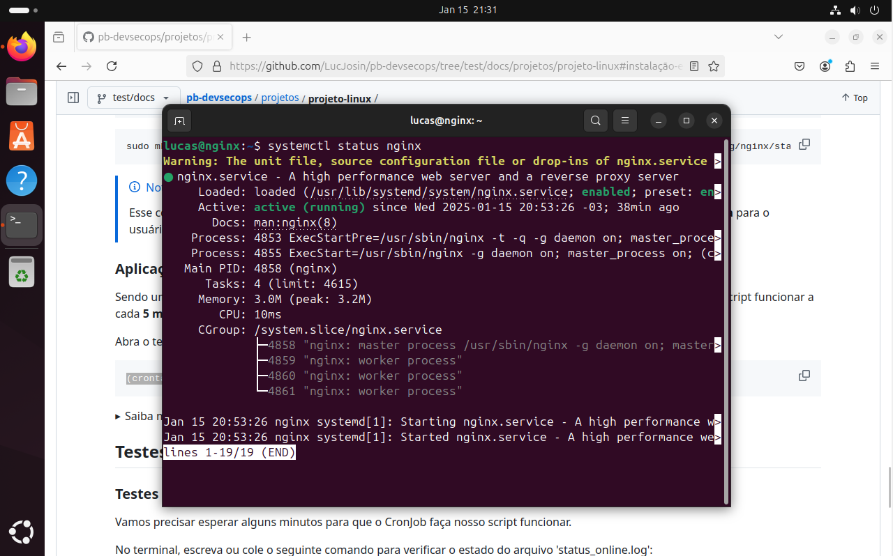
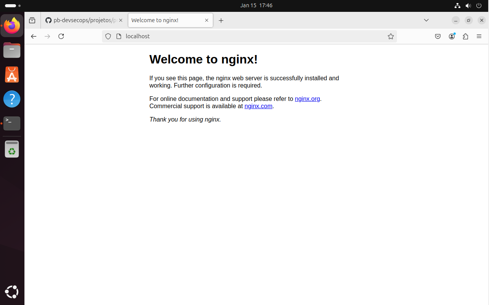
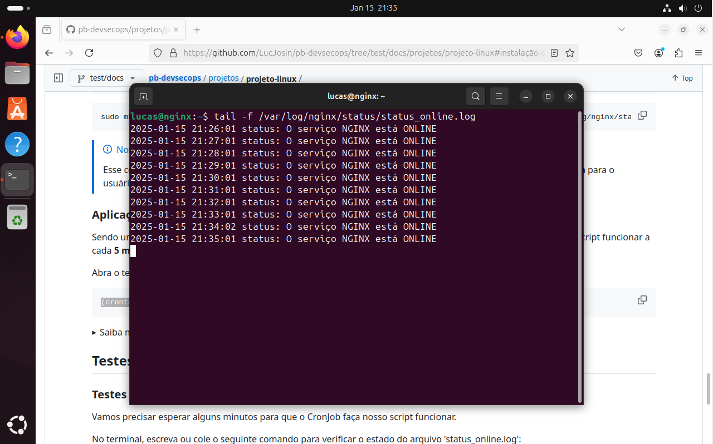
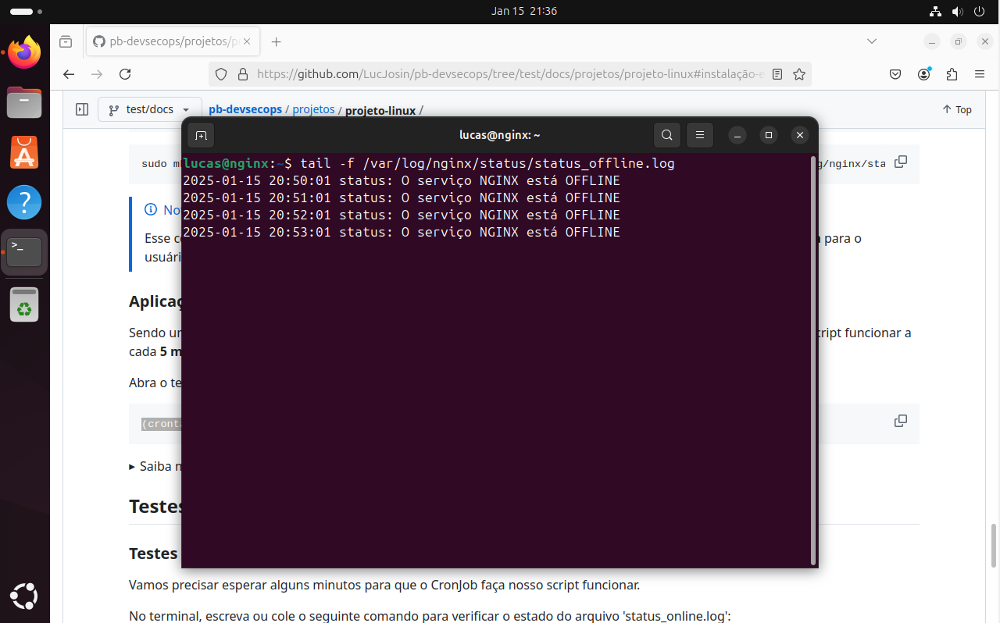

<h3 align="center">< Projeto Linux /></h3>

<h1 align="center">
     Compass UOL - DevSecOps
</h1>

Projeto Linux da trilha de **DevSecOps**, passo a passo dividido em duas partes:

1. Implementação do WSL on Windows com a distribuição Ubuntu;

- **Requisitos:**
  - Windows 10/11;
  - Acesso ao PowerShell;
  - Acesso de administrador.

2. Instalação do NGINX e a integração com um script para validar o status.

- **Requisitos:**
  - Sistema com Linux instalado (Ubuntu);
  - Acesso de administrador (root);
  - Conexão com a internet para instalar pacotes **(Recomendado, mas opcional)**.

## Tópicos

- [Ambiente Linux no Windows](#ambiente-linux-no-windows-wsl)
  - [Instalação do WSL](#instalação-do-wsl)
  - [Instalação do Ubuntu](#instalação-do-ubuntu)
- [Instalação e Monitoramento do NGINX](#instalação-e-monitoramento-do-nginx)
  - [Atualização de pacotes](#atualização-de-pacotes)
  - [Instalação do Nginx](#instalação-do-nginx)
  - [Criação do Script](#criação-do-script)
  - [Atualização das permissões](#atualização-das-permissões)
  - [Aplicação do CronJob](#aplicação-do-cronjob)
- [Testes e Validação](#testes-e-validação)
  - [Testes com estado Online](#testes-com-estado-online)
  - [Testes com estado Offline](#testes-com-estado-offline)

## Ambiente Linux no Windows (WSL)

### Instalação do WSL

Com o PowerShell aberto **(e com permissão de administrador)**, escreva o comando:

```
wsl --install
```

> [!WARNING]
> É necessário reiniciar o computador após a instalação do **WSL**.

### Instalação do Ubuntu

> [!NOTE]
> Por padrão, a distribuição do **Linux** instalada será o **Ubuntu**, mesmo assim vamos ver como listar as distribuições e instalar o Ubuntu.

**1. Listagem das distribuições**

Para ver uma lista das distribuições do Linux disponíveis, use o comando:

```
wsl --list --online
```

<details>
  <summary>Imagem: Listagem das distribuições</summary>
  
  <br>
  <strong>Source: </strong><a href="https://mattzaskeonline.info/blog/2024-04/getting-started-wsl-quick-installation-guide">mattzaskeonline.info/blog</a>
</details>
<br>

**2. Instalação do **Ubuntu 24.04** _(LTS / 2024-08-29)_**

```
wsl --install -d Ubuntu-24.04
```

<details>
  <summary>Imagem: Instalação do Ubuntu</summary>
  
  <br>
  <strong>Source: </strong><a href="https://mattzaskeonline.info/blog/2024-04/getting-started-wsl-quick-installation-guide">mattzaskeonline.info/blog</a>
</details>

## Instalação e Monitoramento do NGINX

### Atualização de pacotes

Antes de fazer qualquer modificação, atualize os pacotes do sistema para garantir que todas as dependências estejam na versão mais recente:

```
sudo apt update && sudo apt upgrade -y
```

### Instalação do Nginx

Agora com o sistema atualizado, vamos instalar o NGINX usando o APT.

Escreva ou cole o seguinte comando no terminal:

```
sudo apt install nginx -y
```

### Validando o estado do NGINX

**1. Terminal**

Use o comando abaixo para validar o status do NGINX:

```
sudo systemctl status nginx
```

<details>
  <summary>Imagem: Validando o estado do NGINX no terminal</summary>
  
</details>
<br>

**2. Navegador**

Abra o navegador com o seguinte link (ou clique <a href="http://localhost" target="_blank">aqui</a>):

```
localhost
```

<details>
  <summary>Imagem: Validando o estado do NGINX no navegador</summary>
  
</details>

### Garantindo que o NGINX continue online

> [!WARNING]
> Etapa importante para manter o NGINX ativo.

Use o comando abaixo para garantir que o **NGINX** seja inicializado junto com o sistema **após o desligamento ou reinício**.

```
sudo systemctl enable nginx
```

### Criação do Script

#### Arquivo do script

Abra o terminal do Ubuntu e utilize o seguinte comando para criar um arquivo 'sh' na localização **/usr/bin**:

```
sudo touch /usr/bin/nginx_status_check.sh
```

#### Passo a passo (arquivo completo no final)

**Parte 1**

Define esse arquivo executável como um script Bash:

```bash
#!/usr/bin/env bash
```

**Parte 2**

Define uma variável com a localização dos arquivos de log:

```bash
SYS_LOG_DIR="/var/log/nginx/status"
```

**Parte 3**

Define duas variáveis com as localizações dos arquivos onde serão salvos os logs (ONLINE E OFFLINE):

```bash
NGINX_LOG_ONLINE="$SYS_LOG_DIR/online.log"
NGINX_LOG_OFFLINE="$SYS_LOG_DIR/offline.log"
```

**Parte 4**

Define uma variável com a data atual:

```bash
DATE=$(date '+%Y-%m-%d %H:%M:%S')
```

**Parte 5**

Verifica o status atual e escreve nos arquivos **NGINX_status_online** ou **NGINX_status_offline**

```bash
if systemctl is-active --quiet nginx; then
        echo "$DATE status: O serviço NGINX está ONLINE" >> "$NGINX_LOG_ONLINE"
else
        echo "$DATE status: O serviço NGINX está OFFLINE" >> "$NGINX_LOG_OFFLINE"
fi
```

#### Escrendo no arquivo

Para escrever o script no arquivo vamos usar o editor chamado **nano**:

```
sudo nano /usr/bin/nginx_status_check.sh
```

Copie e cole o arquivo completo:

```bash
#!/usr/bin/env bash

# Localização dos arquivos de log do sistema
SYS_LOG_DIR="/var/log/nginx/status"

# Localização dos nossos arquivos de log online e offline
NGINX_LOG_ONLINE="$SYS_LOG_DIR/online.log"
NGINX_LOG_OFFLINE="$SYS_LOG_DIR/offline.log"

# Data atual
DATE=$(date '+%Y-%m-%d %H:%M:%S')

# Verifica o status atual e escreve nos arquivos 'NGINX_LOG_ONLINE' ou 'NGINX_LOG_OFFLINE'
if systemctl is-active --quiet nginx; then
        echo "$DATE status: O serviço NGINX está ONLINE" >> "$NGINX_LOG_ONLINE"
else
        echo "$DATE status: O serviço NGINX está OFFLINE" >> "$NGINX_LOG_OFFLINE"
fi
```

> [!NOTE]
> Use as teclhas <kbd>Ctrl</kbd> + <kbd>C</kbd> para copiar e <kbd>Ctrl</kbd> + <kbd>V</kbd> para colar.

Salvando e saindo do nano:

- <kbd>Ctrl</kbd> + <kbd>O</kbd> para escrever o arquivo;
- <kbd>Enter</kbd> para confirmar;
- <kbd>Ctrl</kbd> + <kbd>X</kbd> para sair do nano;

### Atualização das permissões

Agora, vamos mudar as permissões dos arquivos para permitir a execução/leitura.

**1. Script**

Abra o terminal e escreva/cole o seguinte comando:

```
sudo chmod +x /usr/bin/nginx_status_check.sh
```

> [!NOTE]
> O comando **chmod** irá mudar as permissões do arquivo e o parâmetro **+x** vai permitir a execução em todas as categorias (usuário, grupos e outros, -rwxrwxr-x).

**2. Arquivos de log**

Precisamos criar e atualizar as permissões dos arquivos de log, necessário por conta da localização **(/var/log/)**.

**2.1 Cria a pasta para salvar os logs e modifica o dono para $USER**

```
sudo mkdir /var/log/nginx/status && sudo chown $USER:$USER /var/log/nginx/status
```

**2.2 Cria arquivos de logs e modifica as permissões para 755**

```
sudo touch /var/log/nginx/online.log /var/log/nginx/offline.log && sudo chmod 744 /var/log/nginx/online.log /var/log/nginx/offline.log
```

> Explicação: **744** ou **rwx-r---r--** significa que o usuário vai ter permissão para **ler**, **escrever** e **executar**, os grupos e outros podem apenas **ler**.

**Comando final**

```
sudo mkdir /var/log/nginx/status && sudo chown $USER:$USER /var/log/nginx/status && sudo touch /var/log/nginx/online.log /var/log/nginx/offline.log && sudo chmod 744 /var/log/nginx/online.log /var/log/nginx/offline.log
```

### Aplicação do CronJob

É necessário o monitoramento do estado do **NGINX**, vamos definir um **CronJob** e fazer o script funcionar a cada **5 minutos**.

Abra o terminal e escreva/cole o seguinte comando:

```
(crontab -l; echo "*/5 * * * * /usr/bin/nginx_status_check.sh") | crontab -
```

<details>
  <summary>Saiba mais sobre CronJob</summary>

```
* * * * * /caminho/para/o/comando
- - - - -
| | | | |
| | | | +---- Dia da semana (0 - 7) [Tanto 0 quanto 7 significam Domingo]
| | | +------ Mês (1 - 12)
| | +-------- Dia do mês (1 - 31)
| +---------- Hora (0 - 23)
+------------ Minuto (0 - 59)
```

> \*/5: Significa que o script será executado a cada 5 minutos, começando no minuto 0 de cada hora (por exemplo, 00:00, 00:05, 00:10, etc.).

</details>

## Testes e Validação

### Testes com estado Online

Vamos precisar esperar alguns minutos para que o **CronJob** faça nosso script funcionar.

No terminal, escreva ou cole o seguinte comando para verificar o estado do arquivo 'online.log':

```
tail -f /var/log/nginx/status/online.log
```

> [!NOTE]
> Esse comando irá ler o arquivo e mostrar sempre que ocorrer alguma atualização. Para sair dele uso as teclas <kbd>Ctrl</kbd> + <kbd>C</kbd>

<details>
  <summary>Imagem: Testes com estado Online</summary>
  
</details>

### Testes com estado Offline

Para testar o estado **Offline** do **NGINX** iremos parar por um momento utilizando o comando:

```
sudo systemctl stop nginx
```

No terminal, escreva ou cole o seguinte comando para verificar o estado do arquivo 'offline.log':

```
tail -f /var/log/nginx/status/offline.log
```

<details>
  <summary>Imagem: Testes com estado Offline</summary>
  
</details>

## Referências

- https://mattzaskeonline.info/blog/2024-04/getting-started-wsl-quick-installation-guide
- https://learn.microsoft.com/pt-br/windows/wsl/install
