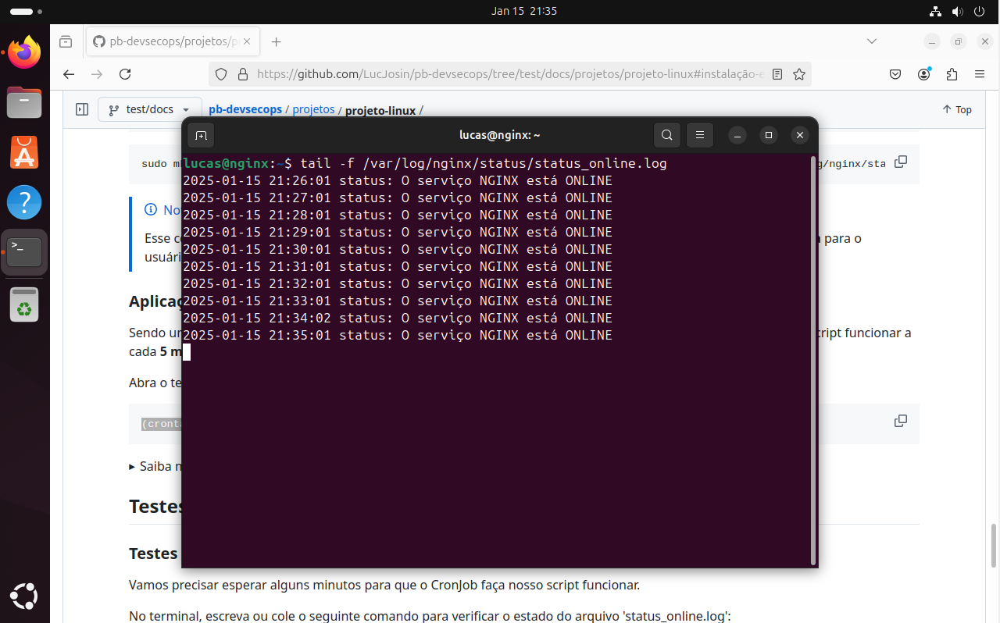

<h3 align="center">< Projeto Linux /></h3>

<h1 align="center">
     Compass UOL - DevSecOps
</h1>

<div align="center">

|      Passo a passo       |  Automatizado  |            Usando AWS            |
| :----------------------: | :------------: | :------------------------------: |
| [README.md](./README.md) | (Esse arquivo) | [README.aws.md](./README.aws.md) |

</div>

Projeto Linux da trilha de **DevSecOps** usando o método automatizado.

- **Requisitos:**
  - Sistema com Linux instalado (Ubuntu);
  - Acesso de administrador (root);
  - Conexão com a internet para instalar pacotes.
  - Pacote **wget** ou **curl** instalado para baixar o arquivo de **setup**.

## Tópicos

- [Atualização de pacotes](#atualização-de-pacotes)
- [Baixando o arquivo de script](#baixando-o-arquivo-de-script)
  - [Usando wget](#usando-wget)
  - [Usando curl](#usando-curl)
- [Ativando o script](#ativando-o-script)
- [Testes e Validação](#testes-e-validação)
  - [Testes com estado Online](#testes-com-estado-online)
  - [Testes com estado Offline](#testes-com-estado-offline)
- [Contexto](#contexto)
- [Removendo](#removendo)
- [Referências (README.md)](./README.md#referências)

## Atualização de pacotes

Antes de fazer qualquer modificação, atualize os pacotes do sistema para garantir que todas as dependências estejam na versão mais recente:

```
sudo apt update && sudo apt upgrade -y
```

## Baixando o arquivo de script

Para baixar o arquivo de script podemos utilizar tanto o pacote **wget** e **curl**.

> [!NOTE]
> Use o comando 'curl --help' e 'wget --help' para saber se estão instalados no sistema.

<details>
    <summary>[Troubleshoot] Caso não tenha nenhum pacote instalado</summary>
    
Se nenhum pacote estiver instalado, no termial use o comando abaixo para instalar o **wget**:

```
sudo apt install wget -y
```

</details>

### Usando wget

Copie e cole o comando abaixo no terminal para baixar o script usando **wget**:

```
wget https://github.com/LucJosin/pb-devsecops/raw/refs/heads/main/projetos/projeto-linux/nginx_setup.sh -P $HOME/Downloads/
```

### Usando curl

Copie e cole o comando abaixo no terminal para baixar o script usando **curl**:

```
curl -o "$HOME/Downloads/nginx_setup.sh" https://github.com/LucJosin/pb-devsecops/raw/refs/heads/main/projetos/projeto-linux/nginx_setup.sh
```

## Ativando o script

Primeiro, adicione permissão para **execução** no script:

```
sudo chmod +x ~/Downloads/nginx_setup.sh
```

Use o comando abaixo para iniciar o script:

```
sudo ~/Downloads/nginx_setup.sh -s
```

## Testes e Validação

### Testes com estado Online

Vamos precisar esperar alguns minutos para que o **CronJob** faça nosso script funcionar.

No terminal, escreva ou cole o seguinte comando para verificar o estado do arquivo 'online.log':

```
tail -f /var/log/nginx/status/online.log
```

> [!NOTE]
> Esse comando irá ler o arquivo e mostrar sempre que ocorrer alguma atualização. Para sair dele uso as teclas <kbd>Ctrl</kbd> + <kbd>C</kbd>

<details>
  <summary>Imagem: Testes com estado Online</summary>
  
</details>

### Testes com estado Offline

Para testar o estado **Offline** do **NGINX** iremos parar por um momento utilizando o comando:

```
sudo systemctl stop nginx
```

No terminal, escreva ou cole o seguinte comando para verificar o estado do arquivo 'offline.log':

```
tail -f /var/log/nginx/status/offline.log
```

<details>
  <summary>Imagem: Testes com estado Offline</summary>
  
</details>

## Contexto

> [!WARNING]
> Todo esse passo a passo foi feito usando **root/sudo**, então os arquivos de log, o script e o cronjob estão todos "no nome do root".
>
> Você pode testar utilizando os comandos:
>
> ```
> ls -ld /var/log/nginx/status/online.log
> ```
>
> ```
> ls -ld /usr/bin/nginx_status_check.sh
> ```
>
> ```
> sudo crontab -l
> ```

## Removendo

Utilize o script em [clean.sh](./clean.sh) para reverter todas as mudanças.
